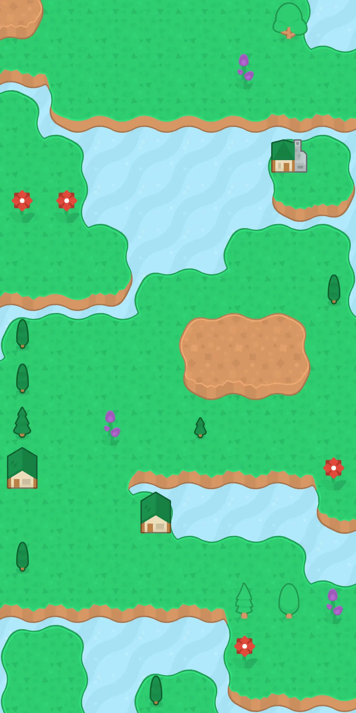
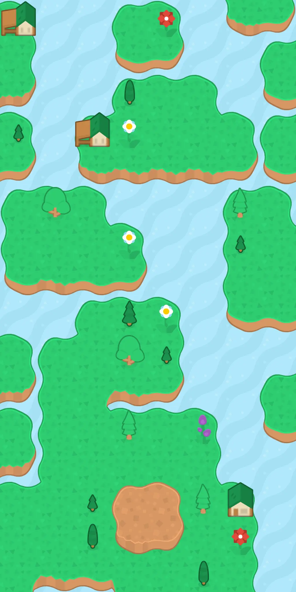

# Procedural Generation of 2D Game Maps for Yaaker

A few months ago I made a little mobile game called Yaaker. It's like a
combination of poker, dice, and aliens.

## Background

I've described in more detail the process of building Yaaker [in my blog](https://heromodeapp.com/blog/heromode-use-case-casual-game-dev).
In addition:

- [Yaaker homepage](https://yaaker.ovisly.com/)
- [Yaaker on the App Store](https://apps.apple.com/us/app/yaaker/id1663559578)

In this repository, we focus on the part of creating game maps. Yaaker is meant
to have many levels where the player travels from town to town. Each town has
its own back story and layout. That means making a lot of maps. So figuring out
how to make a lot of maps with algorithm was a big part of the project.

Assets and tile sets are from [Kenney](https://kenney.itch.io/kenney-game-assets).

## Layered Approach

Procedural generation is a big topic. There are many fascinating and sophisticated
maths and algorithms that can be applied. For Yaaker, we try to come up with something
that's good enough for our needs.

What worked for us is a layered approach that combines several methods:

- A background layer that is created by simply repeating one tile. For example,
  the ocean.
- The first layer that is created by pixel value **edge matching** using [Pillow](https://pypi.org/project/Pillow/).
- The second layer that is created using **genetic algorithm**.
- The last layer contains random obbjects that are placed on the surfaces they are
  allowed to be on based on user configuration.

## Results

With this method, we created five sets of maps for the five towns in the game.
Here are some samples.

### 1 - Queensburg 👑

