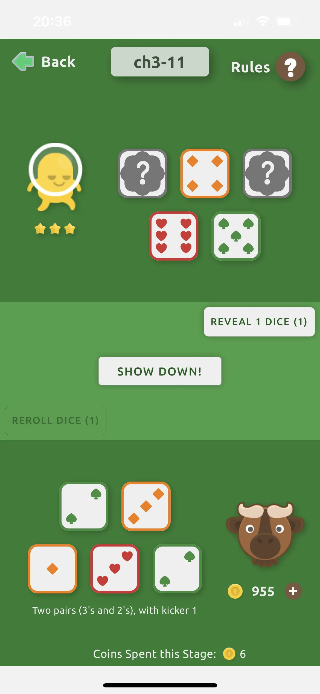

# Procedural Generation of 2D Game Maps for Yaaker

A few months ago I made a little mobile game called Yaaker. It's like a
combination of poker, dice, and aliens.

## Background

I've described in more detail the process of building Yaaker [in my blog](https://heromodeapp.com/blog/heromode-use-case-casual-game-dev).
In addition:

- [Yaaker homepage](https://yaaker.ovisly.com/)
- [Yaaker on the App Store](https://apps.apple.com/us/app/yaaker/id1663559578)

In this repository, we focus on the part of creating game maps. Yaaker is meant
to have many levels where the player travels from town to town. Each town has
its own back story and layout. That means making a lot of maps. So figuring out
how to make a lot of maps with algorithm was a big part of the project.

Assets and tile sets are from [Kenney](https://kenney.itch.io/kenney-game-assets).

## Layered Approach

Procedural generation is a big topic. There are many fascinating and sophisticated
maths and algorithms that can be applied. For Yaaker, we try to come up with something
that's good enough for our needs.

What worked for us is a layered approach that combines several methods:

- A background layer that is created by simply repeating one tile. For example,
  the ocean.
- The first layer that is created by pixel value **edge matching** using [Pillow](https://pypi.org/project/Pillow/).
- The second layer that is created using **genetic algorithm**.
- The last layer contains random obbjects that are placed on the surfaces they are
  allowed to be on based on user configuration.

## Files

The main module is `make_map.py` which orchestrates the creation process of all
the layers. A `params.py` is required to specify the image files for the tile
set. After all the layers are created, they are combined into a single image.

The single image is then split into four screens, so that the user can traverse
the map of the same town with continuity.

Image operations are provided in `utils/img.py`. For example, here we handle how
to construct the first layer by edge matching (`is_mergeable_to_right()` and
`is_mergeable_to_bottom()`).

Genetic algorithm utilities are provided in `utils/genetic_algorithm.py`. In
there, we let the tiles "mutate" to create offsprings. Then their fitness is
calculated based on how well each tile matches its neighbors, including the
first layer.

## Results

With this method, we created five towns, each with four screens. Here are a
couple of examples.

There is also a transition screen for the user to fly between towns.

Each town has 20 stages. And within each stage, the user plays a game of Yaaker
with an alien.

